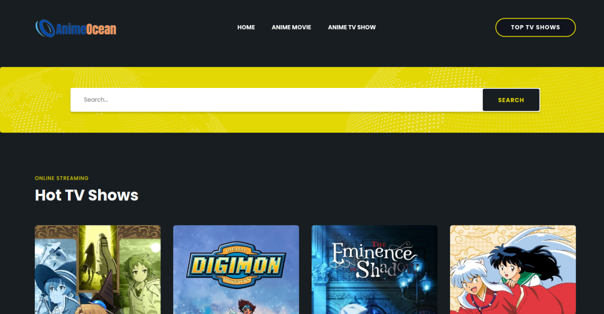
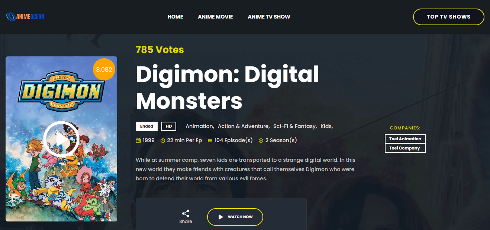

<div align="center">
  
  

  <h2 align="center">Watch Latest Anime Movies & TV Shows | AnimeOcean</h2>

 Watch the Latest trending and popular Japanese anime Movies and TV Shows for free in HD in Both English Dubbed, Subbed as well as French subbed built with PHP and TMDB API based on <a href="https://github.com/codewithsadee/filmlane">Filmelane design</a>

  <a href="https://www.animeocean.top"><strong>➥ Live Demo</strong></a>

</div>

<br />

### Demo Screenshots

## Homepage



## Details page



### Prerequisites

Before you begin, ensure you have met the following requirements:

* [Git](https://git-scm.com/downloads "Download Git") must be installed on your operating system.

### Run Locally

To run **Filmlane** locally, run this command on your git bash:

Linux and macOS:

```bash
sudo git clone https://github.com/mobiprox/animeocean.git
```

Windows:

```bash
git clone https://github.com/mobiprox/animeocean.git
```
### License

This project is **free to use** and does not contain any license.
